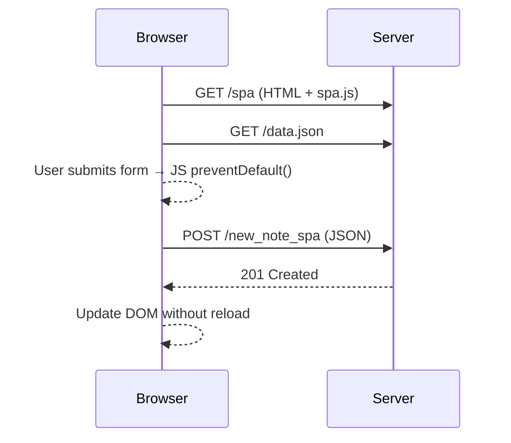

```mermaid
sequenceDiagram
  Browser ->> Server: GET /spa (HTML + spa.js)
  Browser ->> Server: GET /data.json
  Browser -->> Browser: User submits form → JS preventDefault()
  Browser ->> Server: POST /new_note_spa (JSON)
  Server -->> Browser: 201 Created
  Browser -->> Browser: Update DOM without reload
```