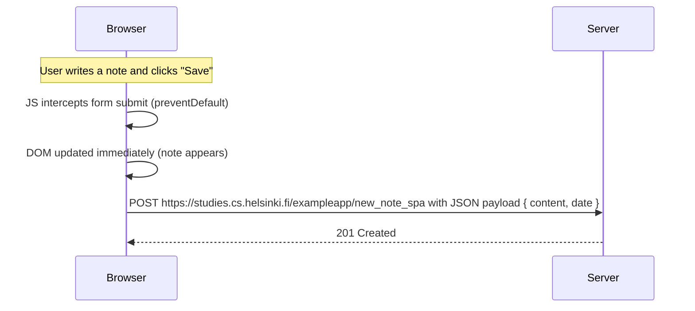

```mermaid
sequenceDiagram
  Note over Browser: User writes a note and clicks "Save"
  Browser ->> Browser: JS intercepts form submit (preventDefault)
  Browser ->> Browser: DOM updated immediately (note appears)
  Browser ->> Server: POST https://studies.cs.helsinki.fi/exampleapp/new_note_spa with JSON payload { content, date }
  
  Server -->> Browser: 201 Created
```
