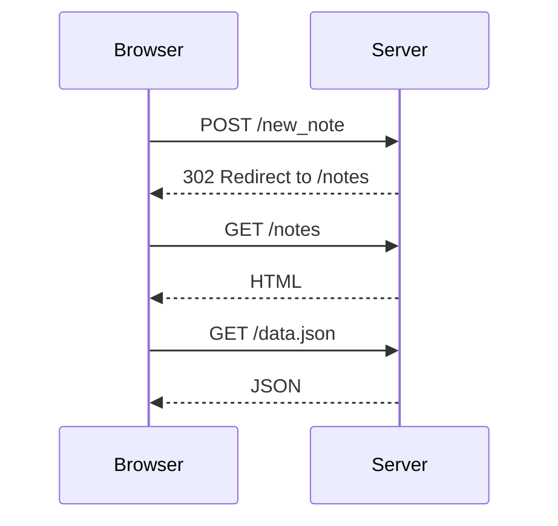
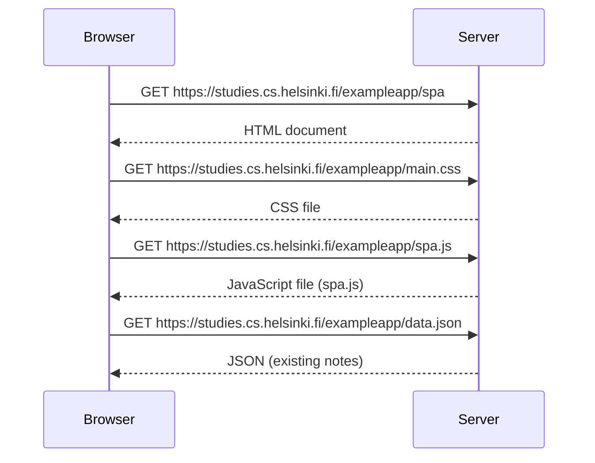
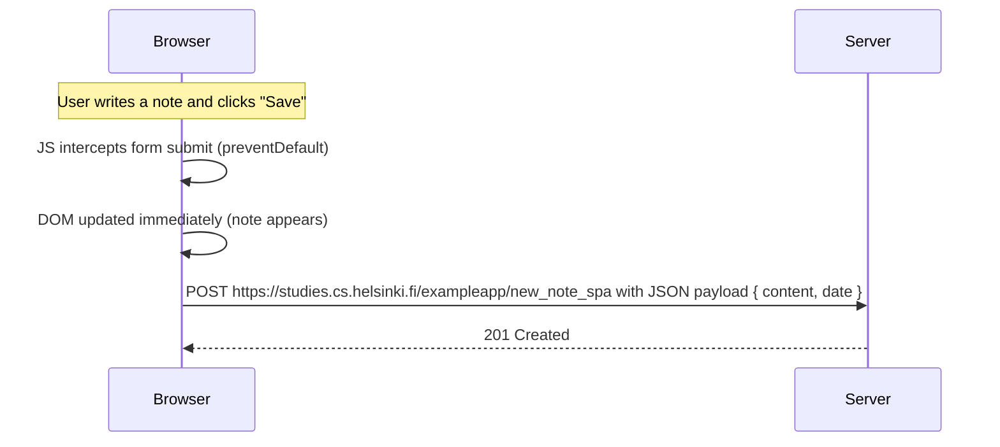

# Exercise Part 0

## 0.4 New Note Diagram

```mermaid
sequenceDiagram
  Browser ->> Server: POST /new_note
  Server -->> Browser: 302 Redirect to /notes

  Browser ->> Server: GET /notes
  Server -->> Browser: HTML
  
  Browser ->> Server: GET /data.json
  Server -->> Browser: JSON
```

## 0.5 Single Page App Diagram

```mermaid
sequenceDiagram
  Browser ->> Server: GET https://studies.cs.helsinki.fi/exampleapp/spa
  Server -->> Browser: HTML document

  Browser ->> Server: GET https://studies.cs.helsinki.fi/exampleapp/main.css
  Server -->> Browser: CSS file

  Browser ->> Server: GET https://studies.cs.helsinki.fi/exampleapp/spa.js
  Server -->> Browser: JavaScript file (spa.js)
  
  Browser ->> Server: GET https://studies.cs.helsinki.fi/exampleapp/data.json
  Server -->> Browser: JSON (existing notes)
```

## 0.6 New Note in Single Page App

```mermaid
sequenceDiagram
  Note over Browser: User writes a note and clicks "Save"
  Browser ->> Browser: JS intercepts form submit (preventDefault)
  Browser ->> Browser: DOM updated immediately (note appears)
  Browser ->> Server: POST https://studies.cs.helsinki.fi/exampleapp/new_note_spa with JSON payload { content, date }
  
  Server -->> Browser: 201 Created
```
